# ERD — P01-S04

Status: DesignOnly. Cardinalities represent the logical model in DOMAIN_MODEL.md.
The diagram is not a migration. `AccountId` points to ASP.NET Core Identity; D035 keeps
Customer independent and permits only a verified, reviewed link without automatic merging.

```mermaid
erDiagram
    DEVELOPER ||--o{ PROJECT : owns
    PROJECT ||--o{ UNIT : contains
    UNIT ||--o{ UNIT_IMAGE : displays
    UNIT ||--o{ UNIT_MARKET_CONFIRMATION : receives
    EMPLOYEE ||--o{ UNIT_MARKET_CONFIRMATION : records

    DEVELOPER ||--o{ MARKETING_AGREEMENT : signs
    MARKETING_AGREEMENT ||--o{ AGREEMENT_PROJECT : selects
    PROJECT ||--o{ AGREEMENT_PROJECT : covered_by
    MARKETING_AGREEMENT ||--|{ COMMISSION_RULE : defines
    PROJECT o|--o{ COMMISSION_RULE : overrides_for

    CUSTOMER ||--o{ CUSTOMER_ASSIGNMENT : assignment_history
    EMPLOYEE ||--o{ CUSTOMER_ASSIGNMENT : responsible_employee
    EMPLOYEE ||--o{ CUSTOMER_ASSIGNMENT : assigning_manager
    CUSTOMER ||--o{ LEAD : opens
    PROJECT ||--o{ LEAD : concerns
    MARKETING_AGREEMENT ||--o{ LEAD : originates_under
    CUSTOMER ||--o{ SALES_NOTE : has_private
    LEAD o|--o{ SALES_NOTE : contextualizes
    EMPLOYEE ||--o{ SALES_NOTE : authors

    CUSTOMER ||--o{ VIEWING : requests
    LEAD o|--o{ VIEWING : supports
    UNIT ||--o{ VIEWING : scheduled_for
    EMPLOYEE o|--o{ VIEWING : confirms
    VIEWING ||--|{ VIEWING_SCHEDULE_REVISION : history

    CUSTOMER ||--o{ RESERVATION_REQUEST : submits
    LEAD o|--o{ RESERVATION_REQUEST : supports
    UNIT ||--o{ RESERVATION_REQUEST : requested_for
    RESERVATION_REQUEST ||--o{ RESERVATION_CANCELLATION : cancellation_actions
    RESERVATION_REQUEST ||--o{ DEPOSIT_CONFIRMATION : deposit_facts
    CUSTOMER ||--o{ RESERVATION_CANCELLATION : requests
    EMPLOYEE o|--o{ RESERVATION_CANCELLATION : resolves
    EMPLOYEE ||--o{ DEPOSIT_CONFIRMATION : records

    CUSTOMER ||--o{ DEAL : purchases
    LEAD ||--o| DEAL : converts_to
    UNIT ||--o{ DEAL : sold_as
    RESERVATION_REQUEST o|--o| DEAL : may_result_in
    MARKETING_AGREEMENT ||--o{ DEAL : applied_to
    COMMISSION_RULE ||--o{ DEAL : applied_rule
    EMPLOYEE ||--o{ DEAL : records
    DEAL ||--|| COMMISSION_SNAPSHOT : snapshots
    DEAL ||--o{ COMMISSION_COLLECTION : collected_by
    EMPLOYEE ||--o{ COMMISSION_COLLECTION : records

    CUSTOMER o|--o{ NOTIFICATION : receives
    EMPLOYEE o|--o{ NOTIFICATION : receives

    DEVELOPER {
        uuid Id PK
        string Code UK
        string Name
        bool IsActive
        long Version
    }
    PROJECT {
        uuid Id PK
        uuid DeveloperId FK
        string Code
        string Name
        string TimeZoneId
        long Version
    }
    UNIT {
        uuid Id PK
        uuid ProjectId FK
        string Code UK
        string PublicationStatus
        string AvailabilityStatus
        decimal ListPrice
        string Currency
        datetime LastAvailabilityConfirmedAtUtc
        long Version
    }
    UNIT_IMAGE {
        uuid Id PK
        uuid UnitId FK
        string StorageKey
        int SortOrder
        bool IsPrimary
    }
    UNIT_MARKET_CONFIRMATION {
        uuid Id PK
        uuid UnitId FK
        uuid RecordedByEmployeeId FK
        datetime ConfirmedAtUtc
        decimal ConfirmedPrice
        string AvailabilityStatus
        string SourceReference
    }
    MARKETING_AGREEMENT {
        uuid Id PK
        uuid DeveloperId FK
        string AgreementNumber UK
        string ScopeType
        date StartsOn
        date EndsOn
        int ProtectionPeriodDays
        string Status
        long Version
    }
    AGREEMENT_PROJECT {
        uuid MarketingAgreementId PK,FK
        uuid ProjectId PK,FK
        datetime AddedAtUtc
    }
    COMMISSION_RULE {
        uuid Id PK
        uuid MarketingAgreementId FK
        uuid ProjectId FK
        string RuleType
        decimal Percentage
        decimal FixedAmount
        string Currency
        long Version
    }
    CUSTOMER {
        uuid Id PK
        string AccountId FK
        string FullName
        string Phone
        string Email
        long Version
    }
    EMPLOYEE {
        uuid Id PK
        string AccountId FK
        string EmployeeNumber UK
        string Role
        bool IsActive
        long Version
    }
    CUSTOMER_ASSIGNMENT {
        uuid Id PK
        uuid CustomerId FK
        uuid EmployeeId FK
        uuid AssignedByManagerId FK
        datetime StartedAtUtc
        datetime EndedAtUtc
        long Version
    }
    LEAD {
        uuid Id PK
        uuid CustomerId FK
        uuid ProjectId FK
        uuid MarketingAgreementId FK
        string Status
        string Source
        datetime OpenedAtUtc
        datetime ClosedAtUtc
        long Version
    }
    SALES_NOTE {
        uuid Id PK
        uuid CustomerId FK
        uuid LeadId FK
        uuid AuthorEmployeeId FK
        string Body
        datetime CreatedAtUtc
    }
    VIEWING {
        uuid Id PK
        uuid CustomerId FK
        uuid LeadId FK
        uuid UnitId FK
        uuid ConfirmedEmployeeId FK
        string Status
        datetime CurrentProposedStartUtc
        datetime CurrentProposedEndUtc
        datetime ConfirmedStartUtc
        datetime ConfirmedEndUtc
        string TimeZoneId
        long Version
    }
    VIEWING_SCHEDULE_REVISION {
        uuid Id PK
        uuid ViewingId FK
        int Sequence UK
        string Kind
        datetime StartUtc
        datetime EndUtc
        uuid SupersedesRevisionId FK
    }
    RESERVATION_REQUEST {
        uuid Id PK
        uuid CustomerId FK
        uuid LeadId FK
        uuid UnitId FK
        string Status
        string DeveloperReference
        decimal ConfirmedPrice
        string Currency
        datetime ReservationDeadlineUtc
        datetime ResponseWaitDeadlineUtc
        long Version
    }
    RESERVATION_CANCELLATION {
        uuid Id PK
        uuid ReservationRequestId FK
        uuid RequestedByCustomerId FK
        string Status
        string DeveloperResponse
        datetime ResolvedAtUtc
        long Version
    }
    DEPOSIT_CONFIRMATION {
        uuid Id PK
        uuid ReservationRequestId FK
        decimal Amount
        string Currency
        string DeveloperReference
        string RefundStatus
        long Version
    }
    DEAL {
        uuid Id PK
        uuid CustomerId FK
        uuid LeadId FK
        uuid UnitId FK
        uuid ReservationRequestId FK
        uuid MarketingAgreementId FK
        uuid AppliedCommissionRuleId FK
        string ExternalSaleReference UK
        datetime SoldAtUtc
        decimal FinalUnitSalePrice
        string Currency
        string Status
        long Version
    }
    COMMISSION_SNAPSHOT {
        uuid DealId PK,FK
        string RuleType
        decimal BasisFinalSalePrice
        decimal Percentage
        decimal FixedAmount
        decimal EntitledAmount
        string Currency
    }
    COMMISSION_COLLECTION {
        uuid Id PK
        uuid DealId FK
        decimal Amount
        string Currency
        datetime CollectedAtUtc
        string Reference
    }
    NOTIFICATION {
        uuid Id PK
        uuid CustomerId FK
        uuid EmployeeId FK
        string Type
        string Title
        string Body
        string ResourceType
        uuid ResourceId
        datetime CreatedAtUtc
        datetime ReadAtUtc
        string DeliveryStatus
        long Version
    }
```

## Cross-cutting records omitted from the main diagram

`AuditEvent`, `CommandReceipt`, and `OutboxMessage` reference aggregates by `(EntityType,
EntityId)` rather than domain foreign keys. Keeping them outside the ERD avoids implying that
generic audit/outbox rows own domain entities. Their schemas are in DOMAIN_MODEL.md and constraints
in CONSTRAINTS.md.

## Cardinality and lifecycle notes

- A Project has exactly one Developer; a Unit has exactly one Project.
- Selected-project agreements use AgreementProject; all-project agreements have no scope rows.
- Every agreement has one default CommissionRule and may have one override for each covered Project.
- Customer has zero or one current assignment and many historical assignments.
- Lead belongs to one Customer, Project and originating MarketingAgreement. The proposed single-open
  lead rule prevents double agreement attribution for the same customer/project.
- Viewing and ReservationRequest may be linked to a Lead. The nullable link accommodates a safe
  migration/import boundary; new interactive journeys should attach the applicable Lead.
- Deal requires one Lead and one immutable CommissionSnapshot. ReservationRequest is optional.
- Unit can have historical Deals in the logical model because reversals/corrections are Open; an
  accepted active-sale uniqueness/state rule must precede a stronger database constraint.

## Open-policy markers

- Q04: Unit freshness and automatic hiding are policy decisions; confirmation history is stable.
- D035: Customer.AccountId stays nullable; linking needs verified ownership and manager review,
  and similar phone/email data never triggers an automatic merge.
- Q06: cancellation/deposit tables exist without assuming approval/refund outcomes.
- Q07: assignments are retained; authorization filters determine former-employee visibility.
- Unit availability after sale and automatic linked-booking completion remain Open.
- Agreement protection vs a later agreement uses the single Lead/agreement selection proposal in
  DOMAIN_MODEL.md; the database prevents two commission snapshots per Deal regardless.
